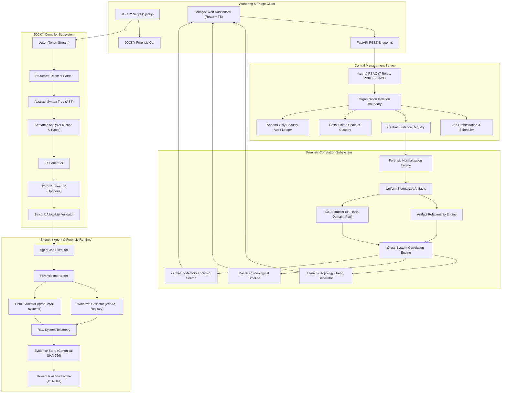

# JOCKY — Digital Forensics Programming Language & Investigation Platform

[]()
[]()
[]()
[]()
[]()
[]()
[]()
[]()
[]()
[]()

> ### 🌐 Live Production Deployment
> - **Frontend Dashboard**: [https://potential-merchants-jelsoft-plastics.trycloudflare.com](https://potential-merchants-jelsoft-plastics.trycloudflare.com)
> - **Backend API & Swagger Docs**: [https://potential-merchants-jelsoft-plastics.trycloudflare.com/docs](https://potential-merchants-jelsoft-plastics.trycloudflare.com/docs)
> - **Health Endpoint**: [https://potential-merchants-jelsoft-plastics.trycloudflare.com/health](https://potential-merchants-jelsoft-plastics.trycloudflare.com/health)
> - **Deployment Guide**: [docs/DEPLOYMENT.md](docs/DEPLOYMENT.md) | **Live Release Report**: [docs/PRODUCTION_DEPLOYMENT_REPORT.md](docs/PRODUCTION_DEPLOYMENT_REPORT.md)

**JOCKY** is a domain-specific forensic programming language (DSL) and centralized digital forensics and incident response (DFIR) platform engineered for authorized computer and network investigation. JOCKY enables security operations teams, forensic examiners, and incident response units to write verifiable, non-destructive triage scripts that execute read-only evidence collections across Windows and Linux endpoints, automatically detect adversary techniques via a deterministic 15-rule detection engine, guarantee cryptographic evidence integrity, and perform cross-system forensic correlation through an interactive web investigation cockpit.

---

## Table of Contents

1. [Project Title & Badges](#jocky--digital-forensics-programming-language--investigation-platform)
2. [What is JOCKY?](#2-what-is-jocky)
3. [Architecture Overview](#3-architecture-overview)
4. [Problem Statement & SIH Relevance](#4-problem-statement--sih-relevance)
5. [Key Capabilities](#5-key-capabilities)
6. [JOCKY Language Quick Start](#6-jocky-language-quick-start)
7. [Threat Detection Engine](#7-threat-detection-engine)
8. [Multi-System Architecture](#8-multi-system-architecture)
9. [Enterprise Security Model](#9-enterprise-security-model)
10. [Forensic Correlation & Investigation Subsystem](#10-forensic-correlation--investigation-subsystem)
11. [Web Dashboard Overview](#11-web-dashboard-overview)
12. [CLI Usage & Modes](#12-cli-usage--modes)
13. [Prerequisites & Dependencies](#13-prerequisites--dependencies)
14. [Installation & Setup](#14-installation--setup)
15. [Running the Platform](#15-running-the-platform)
16. [Demonstration Walkthrough (12-Step Flow)](#16-demonstration-walkthrough-12-step-flow)
17. [Testing & Verification](#17-testing--verification)
18. [Defense-Only Scope & Ethical Principles](#18-defense-only-scope--ethical-principles)
19. [Known Limitations](#19-known-limitations)
20. [Future Scope & Roadmap](#20-future-scope--roadmap)
21. [Team, License & Acknowledgments](#21-team-license--acknowledgments)

---

## 2. What is JOCKY?

JOCKY represents a fundamental paradigm shift in digital forensics. Instead of dispatching arbitrary shell commands (PowerShell, Bash) that risk contaminating suspect endpoints or introducing security vulnerabilities, JOCKY introduces an integrated platform comprising:

- **A Declarative Forensic DSL**: A constrained, non-Turing complete programming language designed specifically for forensic inquiry.
- **A Multi-Stage Compiler Pipeline**: Converts JOCKY scripts into validated Abstract Syntax Trees (AST) and linear Intermediate Representation (IR) opcodes.
- **Strict IR Allow-Listing**: Ensures endpoints execute only pre-authorized, read-only collection instructions.
- **Native Platform Collectors**: Safe userland collectors for Windows (Win32 APIs, Registry) and Linux (`/proc`, `/sys`, systemd).
- **A Deterministic Threat Detection Engine**: Evaluates collected evidence against 15 rules across 7 operational categories mapped to MITRE ATT&CK.
- **A Central Multi-Tenant Management Server**: High-throughput FastAPI backend orchestrating agent fleets, job scheduling, and evidence vaults.
- **Enterprise RBAC & Custody Tracking**: 7-tier access control, PBKDF2 cryptography, canonical JSON SHA-256 evidence hashing, and tamper-evident custody ledgers.
- **Cross-System Correlation Subsystem**: Normalizes heterogeneous host data, extracts Indicators of Compromise (IOCs), maps artifact relationships, detects shared C2 infrastructure, and visualizes incidents via dynamic topology graphs.

---

## 3. Architecture Overview



Detailed architectural documentation is available in [docs/ARCHITECTURE.md](docs/ARCHITECTURE.md).

---

## 4. Problem Statement & SIH Relevance

Incident response teams in enterprise and critical infrastructure environments face acute operational challenges:
1. **Ad-Hoc Triage Inconsistency**: Different investigators employ disparate PowerShell/Bash commands, yielding non-standardized outputs that resist automated aggregation.
2. **Accidental Endpoint Modification**: Running shell scripts often mutates access timestamps, writes temp files to disk, alters registry entries, and invalidates volatile memory.
3. **Security Vulnerabilities in Tooling**: Providing operators with arbitrary remote execution channels creates severe Remote Code Execution (RCE) risks if credentials or agents are intercepted.
4. **Broken Chain of Custody**: Evidence transferred across networks without cryptographic seals lacks legal admissibility.

**How JOCKY Addresses the SIH Problem Statement**:
- JOCKY establishes a formal domain-specific language that standardizes queries across operating systems.
- The JOCKY execution model is mathematically constrained: agents execute only read-only IR opcodes validated against a strict allow-list.
- Canonical JSON hashing (SHA-256) combined with a hash-linked chain-of-custody ledger guarantees court-admissible digital evidence integrity.
- Full traceability against SIH criteria is documented in [docs/PROBLEM_STATEMENT_TRACEABILITY.md](docs/PROBLEM_STATEMENT_TRACEABILITY.md).

---

## 5. Key Capabilities

| Layer | Functional Capability | Technical Implementation |
| :--- | :--- | :--- |
| **Compiler Pipeline** | Verifiable Language Processing | Lexer tokenization (`#` & `//` comments), recursive descent parser, AST construction, semantic prerequisite validation, linear IR generator. |
| **Endpoint Collectors** | Safe Non-Destructive Triage | Windows Win32 API snapshotting, registry queries (`winreg`), Linux `/proc` and `/sys` parsing, systemd unit inspection. |
| **Threat Detection** | Automated Adversary Triage | 15 deterministic detection rules across 7 operational categories mapped to MITRE ATT&CK tactics & techniques. |
| **Central Orchestrator** | Distributed Fleet Management | FastAPI asynchronous backend, cryptographic agent enrollment, periodic heartbeats, automated job queues. |
| **Enterprise Security** | Multi-Tenant Governance | 7 RBAC roles (`SUPER_ADMIN`, `ORG_ADMIN`, `SECURITY_ANALYST`, `SIGNER`, `VERIFIER`, `INVESTIGATOR`, `VIEWER`), PBKDF2 hashing, tenant isolation, audit logging. |
| **Forensic Correlation** | Multi-Host Incident Analysis | Normalization to 6 standard artifact types, directional relationship links, IOC extraction, cross-system C2 correlation, force-directed graph. |
| **Analyst Workspace** | Intuitive DFIR Operations | React 18 + TypeScript + Tailwind CSS UI with 10 dedicated pages, interactive SVG topology graph, master timeline, and global search (`Ctrl+K`). |

---

## 6. JOCKY Language Quick Start

JOCKY scripts (`*.jocky`) provide declarative commands for endpoint collection and threat triage.

### 6.1 Syntax Overview

Scripts support both unified direct scan commands and standard verb-noun syntax, as well as both `#` and `//` comments:

```jocky
# Complete Forensic Scan & Threat Assessment
// Collect comprehensive host telemetry
SYSTEM_INFO
PROCESS_SCAN
NETWORK_SCAN
SERVICE_SCAN
DRIVER_SCAN
PERSISTENCE_SCAN
MEMORY_SCAN
FILE_SCAN

// Run the deterministic threat detection engine
DETECT

// Compile evidence and findings into a sealed report
REPORT "complete_assessment_report"
```

For complete language specifications, see [docs/JOCKY_LANGUAGE_REFERENCE.md](docs/JOCKY_LANGUAGE_REFERENCE.md).

---

## 7. Threat Detection Engine

JOCKY integrates an independent, deterministic threat detection engine that evaluates collected evidence against 15 specialized rules across 7 domains:

1. **PROCESS**:
   - `PROC_001`: Masquerading system binaries (e.g., `svchost.exe` running from user directories).
   - `PROC_002`: Execution from temporary/staging paths (`/tmp`, `AppData\Local\Temp`).
   - `PROC_003`: Suspicious parent-child process relationships.
2. **PERSISTENCE**:
   - `PERSIST_001`: Suspicious Windows Run/RunOnce registry entries.
   - `PERSIST_002`: Unauthorized scheduled tasks and cron jobs in non-standard paths.
3. **DRIVER**:
   - `DRV_001`: Known vulnerable driver detection (BYOVD attack vector).
   - `DRV_002`: Unsigned driver modules in kernel space.
4. **NETWORK**:
   - `NET_001`: Outbound connections to known command-and-control (C2) ports.
   - `NET_002`: Non-standard listening ports bound to user processes.
   - `NET_003`: High-frequency beaconing cadence indicators.
5. **MEMORY**:
   - `MEM_001`: Excessive virtual-to-working-set commit ratio (potential hollowed memory).
   - `MEM_002`: Anomalous thread counts in standard system processes.
6. **SERVICE**:
   - `SVC_001`: Unquoted service binary paths containing spaces.
   - `SVC_002`: Services executing from world-writable paths.
7. **FILE**:
   - `FILE_001`: Double-extension and executable masquerading in temporary folders.

Each finding includes rule ID, severity rank (`CRITICAL`, `HIGH`, `MEDIUM`, `LOW`, `INFO`), confidence score (0.0 to 1.0), and MITRE ATT&CK tactic/technique IDs.

---

## 8. Multi-System Architecture

JOCKY operates seamlessly across multi-endpoint networks:

```
[ Central FastAPI Server ] ─── REST / WebSocket ─── [ Distributed Endpoint Agents ]
         │                                                      │
         ├─ Organization Isolation                              ├─ Windows Host Agent
         ├─ Asynchronous Job Queue                              ├─ Linux Server Agent
         ├─ Central Evidence Vault                              └─ Cloud VM Agent
         └─ Correlation Engine
```

- **Agent Enrollment**: Each agent generates a hardware-bound RSA/HMAC identity (`.jocky_agent_identity.json`) upon startup.
- **Heartbeat & Liveness**: Agents report health and telemetry every 10 seconds.
- **Safe Dispatch**: Server compiles scripts into IR, validates against the allow-list, and places jobs in the agent's queue. Agents re-verify the allow-list prior to execution.

---

## 9. Enterprise Security Model

Enterprise security controls are documented comprehensively in [docs/SECURITY_DEMO.md](docs/SECURITY_DEMO.md):

- **7 RBAC Roles**:
  - `SUPER_ADMIN`: Global fleet governance and tenant lifecycle.
  - `ORGANIZATION_ADMIN`: Organization user provisioning and agent authorization.
  - `SECURITY_ANALYST`: Forensic job creation, dispatch, and triage.
  - `SIGNER`: Cryptographic evidence signing and chain-of-custody seal attestation.
  - `VERIFIER`: Independent mathematical verification of evidence hashes and custody ledgers.
  - `INVESTIGATOR`: Case management, artifact tagging, note taking, snapshot freezing.
  - `VIEWER`: Read-only access to dashboards and sanitized reports.
- **Configurable PBKDF2**: Hashing iterations configurable via `JOCKY_PBKDF2_ITERATIONS` (310,000 in production, 1,000 in tests).
- **Canonical Evidence Hashing**: Every evidence record is canonicalized (sorted keys, compact whitespace) and hashed with SHA-256. Single-bit tampering is immediately detected.
- **Hash-Linked Chain of Custody**: Cryptographically links all evidence lifecycle events (`COLLECTED`, `RECEIVED`, `TRANSFERRED`, `VIEWED`, `ARCHIVED`).
- **Append-Only Audit Ledger**: Non-repudiable audit logging recording actor, action, resource, IP, and timestamp.

---

## 10. Forensic Correlation & Investigation Subsystem

Detailed in [docs/INVESTIGATION_DEMO.md](docs/INVESTIGATION_DEMO.md), the Step 6 correlation subsystem transforms fragmented evidence into actionable intelligence:

- **Normalization**: Heterogeneous Windows/Linux records are transformed into standard `NormalizedArtifact` schemas (Process, Socket, Driver, Service, Persistence, File).
- **Directional Relationships**: Maps dependencies (`PARENT_OF`, `CONNECTED_TO`, `LOCATED_AT`, `EXECUTED_FROM`).
- **IOC Extraction**: Automatically indexes IPs, domains, hashes, and paths with occurrence frequencies and severity scores.
- **Cross-System Correlation**: Detects multi-endpoint attacks, such as shared C2 IP communication across Windows and Linux machines.
- **Dynamic Topology Graph**: SVG force-directed visualizer with node clustering and severity rings.
- **Global Forensic Search**: Sub-second in-memory search (`Ctrl+K`) across all entities.

---

## 11. Web Dashboard Overview

The React 18 + TypeScript + Tailwind CSS web interface provides 10 dedicated operational pages:

1. **Dashboard (`/`)**: Fleet overview, total endpoints, active jobs, critical findings count, and recent activity.
2. **Agents (`/agents`)**: Fleet management, agent trust lifecycle (`PENDING`, `AUTHORIZED`, `SUSPENDED`, `REVOKED`), and heartbeat monitoring.
3. **Jobs (`/jobs`)**: Script editor, template selector ("Complete Threat Assessment"), compiler validator, and job execution status.
4. **Evidence (`/evidence`)**: Raw evidence registry, canonical SHA-256 verification modal, and hash-linked chain-of-custody ledger.
5. **Findings (`/findings`)**: Threat findings list, severity filtering, confidence scores, and MITRE ATT&CK mappings.
6. **Correlations (`/correlations`)**: Cross-system correlation clusters, shared C2 tracking, and multi-endpoint campaign findings.
7. **Timeline (`/timeline`)**: Master chronological reconstruction of all forensic and threat events across the fleet.
8. **Investigations (`/investigations`)**: Interactive investigation cockpit, dynamic SVG topology entity graph, case notes, and snapshots.
9. **Reports (`/reports`)**: Executive report generation, cryptographic seal verification, and HTML/JSON exports.
10. **Audit Logs (`/audit-logs`)**: Append-only security audit trail, filterable by actor, action, and outcome.

---

## 12. CLI Usage & Modes

JOCKY features a standalone command-line interface (`cli.py`) for local forensic operations:

```bash
# 1. Simulation Mode (Compiles script, generates IR, simulates telemetry)
python cli.py examples/forensic_complete.jocky

# 2. Real Host Collection Mode (Direct Win32/Linux API extraction)
python cli.py examples/forensic_complete.jocky --real

# 3. Real Collection with Automated Threat Detection
python cli.py examples/forensic_complete.jocky --real --detect

# 4. Structured JSON Output
python cli.py examples/forensic_complete.jocky --real --detect --json
```

---

## 13. Prerequisites & Dependencies

- **Python**: 3.11, 3.12, or 3.13
- **Node.js**: v18.0.0 or higher
- **npm**: v9.0.0 or higher
- **Supported Operating Systems**: Windows 10/11, Windows Server 2019/2022, Ubuntu 20.04/22.04/24.04 LTS, Debian 11/12

### Backend Dependencies (`requirements.txt`)
- `fastapi>=0.115.0`, `uvicorn>=0.30.0`, `pydantic>=2.8.0`
- `sqlalchemy>=2.0.0`, `psutil>=6.0.0`, `pytest>=8.0.0`
- `python-jose[cryptography]>=3.3.0`, `passlib[bcrypt]>=1.7.4`

---

## 14. Installation & Setup

### Step 1: Clone the Repository
```bash
git clone https://github.com/adityakumar933046-art/JOCKY.git
cd JOCKY
```

### Step 2: Set Up Python Virtual Environment
```bash
python -m venv venv
# On Windows:
.\venv\Scripts\activate
# On Linux:
source venv/bin/activate

pip install -r requirements.txt
```

### Step 3: Configure Environment Variables
```bash
# On Windows:
copy .env.example .env
# On Linux:
cp .env.example .env
```

### Step 4: Build the Frontend
```bash
cd frontend
npm install
npm run build
cd ..
```

---

## 15. Running the Platform

To operate the full distributed platform, launch the three core services:

```bash
# Terminal 1: Launch Central FastAPI Server
python -m uvicorn server.main:app --host 127.0.0.1 --port 8000

# Terminal 2: Launch Endpoint Agent
python -m agent.agent

# Terminal 3: Launch Frontend Dashboard
cd frontend && npm run dev -- --host 127.0.0.1
```

Access the web interface at `http://localhost:5173` (or `http://localhost:5174`) and the interactive API documentation at `http://localhost:8000/docs`.

---

## 16. Demonstration Walkthrough (12-Step Flow)

Follow the comprehensive [docs/SIH_DEMONSTRATION_GUIDE.md](docs/SIH_DEMONSTRATION_GUIDE.md) for live jury evaluation:

1. **Health Verification**: Query `/api/health` to confirm server and database status.
2. **Compiler Simulation**: Execute `python cli.py examples/forensic_complete.jocky`.
3. **Live Forensic Scan**: Execute `python cli.py examples/forensic_complete.jocky --real --detect`.
4. **Multi-Role Authentication**: Demonstrate RBAC logins (`admin`, `analyst`, `signer`, `verifier`).
5. **Agent Fleet Trust**: View connected endpoints and trust state transitions on `/agents`.
6. **Script Authoring**: Load "Complete Threat Assessment" template and validate AST/IR.
7. **Job Dispatch**: Submit job and observe automated evidence ingestion.
8. **Evidence Integrity**: Verify canonical SHA-256 seal and view hash-linked custody ledger.
9. **Threat Detection**: Inspect rule findings, confidence scores, and MITRE ATT&CK tactics.
10. **Cross-System Correlation**: Review shared C2 and multi-host campaign detections.
11. **Investigation Cockpit**: Explore dynamic SVG force-directed topology graph and timeline.
12. **Global Search & Export**: Perform instant search (`Ctrl+K`) and export executive HTML report.

---

## 17. Testing & Verification

JOCKY features an exhaustive automated test suite validating every tier of the platform:

```bash
# 1. Run Complete Pytest Suite (135 tests)
python -m pytest tests -v

# 2. Run Step 4 Multi-System Collection E2E (15 checks)
python -m scripts.e2e_demo

# 3. Run Step 5 Enterprise Security E2E (27 checks)
python -m scripts.e2e_security_demo

# 4. Run Step 6 Advanced Correlation E2E (20 checks)
python -m scripts.e2e_correlation_demo

# 5. Verify Frontend Production Build
cd frontend && npm run build
```

*Verified Test Baseline: 197 automated assertions passing with 100% success rate.*

---

## 18. Defense-Only Scope & Ethical Principles

JOCKY is engineered exclusively for **authorized, non-destructive digital forensics and threat detection**. In compliance with cybersecurity legal frameworks and ethical research standards:

- **Strict Read-Only Operations**: Collectors only extract telemetry using standard OS APIs. No file modification, process manipulation, or registry writing primitives exist in the language.
- **No Evasion Mechanics**: JOCKY intentionally contains no antivirus/EDR bypass mechanisms, no process hollowing, no reflective DLL injection, no direct syscall stubs, and no credential harvesting code.
- **Mathematical Safety**: The execution runtime restricts agents to pre-authorized IR opcodes; arbitrary shell execution is structurally impossible.

See [docs/PROBLEM_STATEMENT_TRACEABILITY.md](docs/PROBLEM_STATEMENT_TRACEABILITY.md) for detailed ethical and compliance justification.

---

## 19. Known Limitations

- **Physical RAM Dumps**: JOCKY collectors operate in userland and rely on standard OS APIs; deep kernel memory acquisition (raw RAM imaging) requires specialized kernel drivers (e.g., WinPmem).
- **Encrypted TLS Payloads**: Network socket collection inspects connections, state, and process ownership, but does not perform deep packet payload decryption.
- **Offline Disk Imaging**: JOCKY is optimized for live system triage and multi-endpoint incident response rather than dead-box bitstream disk imaging (e.g., E01 creation).

---

## 20. Future Scope & Roadmap

- **YARA & Sigma Integration**: Native compilation of YARA and Sigma rules into JOCKY IR opcodes.
- **Distributed Agent Mesh**: Peer-to-peer evidence aggregation for bandwidth-constrained field operations.
- **Automated Memory Dumper**: Optional kernel-level acquisition driver for full physical RAM snapshots.
- **Cloud Forensics Collectors**: Native API collectors for AWS CloudTrail, Azure Activity Logs, and GCP Audit Logs.

---

## 21. Team, License & Acknowledgments

### License
This project is open-source software licensed under the [MIT License](LICENSE).

### Acknowledgments
- Developed for the **Smart India Hackathon (SIH)**.
- Built using Python, FastAPI, React, TypeScript, Tailwind CSS, and standard DFIR methodologies.
