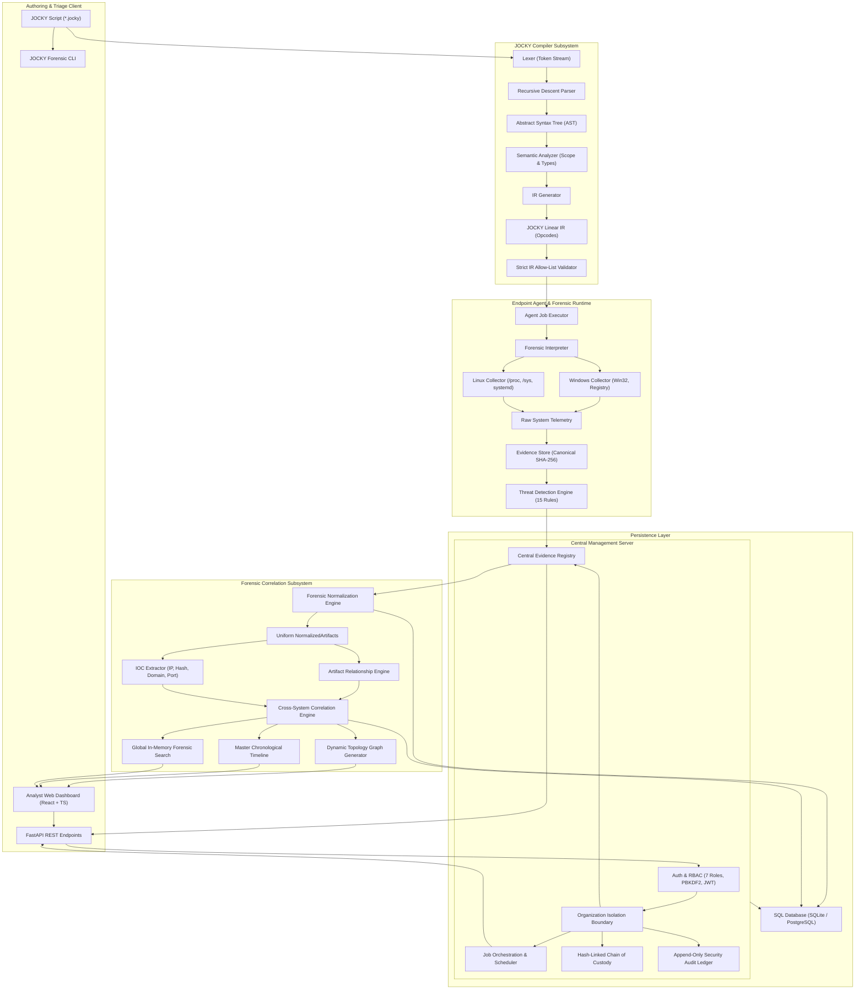

# JOCKY System Architecture Specification

## 1. Executive Architecture Summary

JOCKY is a cross-platform digital forensics, threat detection, and incident response platform constructed around a proprietary, verifiable forensic scripting language (JOCKY DSL). The platform bridges the gap between decentralized endpoint triage and enterprise-scale investigation by coupling a deterministic compiler pipeline with read-only endpoint collectors, canonical cryptographic verification, multi-tenant governance, and graph-based cross-system forensic correlation.

---

## 2. End-to-End Data Flow

The lifecycle of an investigation operation through the JOCKY platform follows a strict, verifiable data pipeline:

1. **Script Authoring**: The security analyst creates or selects a JOCKY triage script containing declarative statements (e.g., `SYSTEM_INFO`, `PROCESS_SCAN`, `NETWORK_SCAN`, `DETECT`, `REPORT`).
2. **Compilation & IR Generation**:
   - The lexer tokenizes commands, targets, and parameters, handling both `#` and `//` comments.
   - The parser constructs an AST validating structural grammar.
   - The semantic analyzer confirms evidence prerequisites (e.g., verifying that data collection opcodes precede a `DETECT` command).
   - The IR generator produces linear JOCKY IR opcodes.
3. **Defense-in-Depth Allow-List Audit**: Before dispatch, the central server validates that every opcode in the compiled IR belongs to the pre-authorized read-only list (`SYSTEM_INFO`, `SCAN`, `ANALYZE`, `DETECT`, `REPORT`). Any unrecognized instructions or shell commands cause immediate rejection.
4. **Agent Dispatch & Trust Validation**: The central server delivers the job to an enrolled agent in the `AUTHORIZED` state. Agents in `PENDING`, `SUSPENDED`, or `REVOKED` states are barred from receiving jobs.
5. **Read-Only Local Execution**: The agent interpreter dispatches collection calls to native platform collectors (Windows Win32/Registry or Linux `/proc`/`/sys`). All collections operate strictly in read-only mode without executing host shells or modifying system files.
6. **Canonical Evidence Hashing**: Captured data is structured into an `EvidenceRecord`, serialized into canonical deterministic JSON (sorted keys, compact whitespace), and hashed using SHA-256. This hash forms an immutable baseline.
7. **Threat Detection**: The agent or server runs the rule registry against captured evidence, generating findings mapped to MITRE ATT&CK tactics and techniques.
8. **Central Ingestion & Custody Logging**: Raw evidence and findings are ingested into the central database. A chain-of-custody ledger record is created linking the agent identity, analyst, timestamp, and SHA-256 hash.
9. **Forensic Normalization**: The normalization engine transforms raw heterogeneous JSON into standardized `NormalizedArtifact` models across six primary item types: Process, Network Socket, Driver, Service, Persistence, and File.
10. **Relationship & IOC Graph Synthesis**: The correlation engine builds directional links (`PARENT_OF`, `CONNECTED_TO`, `LOCATED_AT`, `EXECUTED_FROM`) and extracts Indicators of Compromise (IPs, domains, hashes).
11. **Cross-System Correlation**: Identical IOCs detected across disparate endpoints (e.g., matching external C2 IP addresses on both Windows and Linux hosts) are correlated into multi-endpoint campaign findings.
12. **Visual Investigation**: The results are surfaced to the analyst in the React dashboard through interactive force-directed entity graphs, master chronological timelines, and global forensic search.

---

## 3. Subsystem Breakdown

### 3.1 Compiler Subsystem (`compiler/`)
- **Lexer (`lexer.py`)**: Tokenizes source text, recognizing keywords (`SYSTEM`, `INFO`, `SCAN`, `PROCESSES`, `NETWORK`, `DRIVERS`, `SERVICES`, `FILES`, `ANALYZE`, `PERSISTENCE`, `MEMORY`, `DETECT`, `REPORT`, etc.) and direct command forms (`PROCESS_SCAN`, `NETWORK_SCAN`, `SERVICE_SCAN`, `DRIVER_SCAN`, `PERSISTENCE_SCAN`, `MEMORY_SCAN`, `FILE_SCAN`, `SYSTEM_INFO`).
- **AST Nodes (`ast.py`)**: Defines strongly typed AST representations (`Program`, `Command`, `ScanCommand`, `AnalyzeCommand`, `SystemInfoCommand`, `DetectCommand`, `ReportCommand`).
- **Parser (`parser.py`)**: Implements recursive descent parsing, transforming token sequences into typed AST nodes while recording line and column coordinates for syntax errors.
- **Semantic Analyzer (`semantic.py`)**: Enforces semantic rules, verifies valid target categories, flags redundant commands, and confirms that threat detection is only requested when compatible evidence is collected.
- **IR Generator (`ir.py`)**: Produces linear `IROpcode` instances with operation codes and argument dictionaries, providing a portable, auditable execution blueprint.

### 3.2 Runtime & Platform Collectors (`runtime/`)
- **Forensic Interpreter (`interpreter.py`)**: Dispatches IR instructions to either simulation mode or real host collectors.
- **Windows Collector (`runtime/collectors/windows_collector.py`)**:
  - Process Enumeration: Win32 API snapshot (`CreateToolhelp32Snapshot`, `Process32First/Next`) or WMI/psutil inspection to extract PID, PPID, executable path, command-line arguments, and integrity level.
  - Network Sockets: Queries active TCP/UDP endpoints, listening states, and owning process PIDs.
  - Registry & Persistence: Audits Run/RunOnce keys (`HKLM\Software\Microsoft\Windows\CurrentVersion\Run`, `HKCU\...`), Startup folders, and scheduled task definitions in read-only mode.
  - Services & Drivers: Queries the Windows Service Control Manager (SCM) and loaded system drivers (`EnumDeviceDrivers`).
- **Linux Collector (`runtime/collectors/linux_collector.py`)**:
  - Process Inspection: Reads `/proc/[pid]/status`, `/proc/[pid]/cmdline`, `/proc/[pid]/stat`, and `/proc/[pid]/exe`.
  - Network Auditing: Parses `/proc/net/tcp`, `/proc/net/udp`, and `/proc/net/tcp6` for socket connections and bound ports.
  - Services & Daemons: Inspects systemd units (`systemctl list-units --type=service` or direct unit file parsing in `/etc/systemd/system`).
  - Persistence Audits: Audits cron directories (`/etc/cron*`, `/var/spool/cron`), init scripts (`/etc/init.d`), and user shell profile files.

### 3.3 Evidence Integrity & Chain of Custody (`evidence/`, `server/models/`)
- **Evidence Model (`evidence/model.py`)**: Defines `EvidenceRecord` containing metadata (`evidence_id`, `collected_at`, `target_system`, `collector_type`, `schema_version`, `status`, `hash`, `raw_data`).
- **Canonical Serialization (`evidence/store.py`)**: Normalizes JSON data by sorting all dictionary keys recursively and using strict compact formatting (`separators=(',', ':')`) to guarantee bit-for-bit SHA-256 reproducibility across different operating systems.
- **Chain of Custody Ledger (`server/models/chain_of_custody.py`)**: Append-only log recording every lifecycle transition:
  - `COLLECTED`: Generated on the endpoint at capture time.
  - `RECEIVED`: Verified upon central server ingestion.
  - `TRANSFERRED`: Relocated across storage volumes or exported.
  - `VIEWED`: Accessed by an analyst or investigator.
  - `ARCHIVED`: Sealed for long-term retention.

### 3.4 Threat Detection Engine (`detection/`)
- **Engine Core (`engine.py`)**: Orchestrates automated detection rules against raw or normalized evidence records.
- **Rule Registry (`registry.py`)**: Thread-safe registry hosting 15 deterministic detection rules.
- **Coverage Domains**:
  - `PROCESS`: Parent-child mismatch, execution from temp/AppData, masquerading system binaries.
  - `PERSISTENCE`: Suspicious registry autoruns, unauthorized cron paths, hidden service persistence.
  - `DRIVER`: Known vulnerable drivers (BYOVD risk), unsigned driver modules, suspicious path loading.
  - `NETWORK`: Unexpected outbound connections, non-standard listening ports, beaconing cadence.
  - `MEMORY`: Excessive virtual-to-working set commit ratios, anomalous thread counts.
  - `SERVICE`: Unquoted service binary paths, services executing from world-writable paths.
  - `FILE`: Suspicious extensions, executable files residing in `/tmp` or `C:\Windows\Temp`.
- **Standardized Finding Model (`finding.py`)**: Includes `finding_id`, `rule_id`, `severity` (`CRITICAL`, `HIGH`, `MEDIUM`, `LOW`, `INFO`), `confidence` (0.0 to 1.0), `title`, `description`, `evidence_id`, `mitre_tactics`, `mitre_techniques`, and `remediation`.

### 3.5 Central Multi-System Architecture (`server/`, `agent/`)
- **Central FastAPI Server (`server/main.py`)**: High-performance asynchronous REST API handling endpoints, authentication, jobs, telemetry, findings, correlation, and search.
- **Agent Trust Lifecycle (`server/models/agent.py`)**:
  - `PENDING`: Initial state upon first cryptographic enrollment handshake.
  - `AUTHORIZED`: Approved by an administrator for job reception and evidence submission.
  - `SUSPENDED`: Temporarily halted; jobs will not be dispatched.
  - `REVOKED`: Cryptographic credentials invalidated; agent permanently decommissioned.
- **Agent Daemon (`agent/agent.py`)**: Persistent background daemon maintaining local state, generating hardware-bound identities, issuing periodic heartbeats, and polling the central server for authorized jobs.

### 3.6 Enterprise Security Architecture (`server/security/`)
- **Authentication**: Salted PBKDF2-HMAC-SHA256 password hashing with environment-configurable iteration counts (defaulting to 310,000 for production and 1,000 for rapid testing), JWT bearer tokens, and brute-force lockout protection.
- **7-Tier Role-Based Access Control (RBAC)**:
  - `SUPER_ADMIN`: Full administrative control across all organizations.
  - `ORGANIZATION_ADMIN`: Administrative control within a single organization.
  - `SECURITY_ANALYST`: Forensic script execution, evidence inspection, and triage.
  - `SIGNER`: Authorized to cryptographically seal evidence records and attest chain-of-custody proofs.
  - `VERIFIER`: Authorized to run independent cryptographic hash verification on evidence and custody records.
  - `INVESTIGATOR`: Case workspace management, artifact tagging, note taking, and snapshot creation.
  - `VIEWER`: Read-only access to dashboards and sanitized investigation reports.
- **Multi-Tenant Organization Isolation**: Database queries enforce organization ID boundaries, preventing cross-tenant data leaks.
- **Security Audit Logging (`server/models/audit_log.py`)**: Append-only audit trail logging every security-relevant event (actor, action, target resource, client IP address, timestamp, outcome).

### 3.7 Advanced Forensic Correlation Subsystem (`forensics/`)
- **Normalization Engine (`forensics/normalization/`)**: Converts unstructured raw evidence JSON into strongly typed `NormalizedArtifact` models.
- **Relationship Extraction (`forensics/normalization/relationships.py`)**: Analyzes artifact hierarchies to generate directional relationship graphs (`source -> relation -> target`).
- **Indicator Extraction (`forensics/indicators/`)**: Scans artifact properties for IP addresses, URLs, domains, MD5/SHA-256 hashes, and file paths, computing frequency counts and assigning severity ratings.
- **Cross-System Correlation (`forensics/correlation/`)**: Evaluates multi-host artifacts against detection rules to detect multi-stage intrusions, shared command-and-control (C2) infrastructure, and lateral movement.
- **Master Chronological Timeline (`forensics/timeline/`)**: Aggregates disparate evidence timestamps into a single, unified chronological sequence.
- **Dynamic Topology Graph (`forensics/graph/`)**: Generates node-link graph data formatted for visualization in the React interface.
- **Global Forensic Search (`server/services/correlation_service.py`)**: Sub-second in-memory search across artifacts, findings, indicators, and systems.

---

## 4. Security Boundaries & Read-Only Guarantees

JOCKY enforces rigorous defensive boundaries to ensure evidence admissibility and system safety:

1. **Non-Destructive Execution**: The JOCKY compiler and runtime do NOT possess primitives for file writing, file deletion, registry modification, process killing, memory patching, or network packet injection.
2. **No Shell Invocations**: Host shell interpreters (`cmd.exe`, `powershell.exe`, `/bin/sh`, `/bin/bash`) are strictly prohibited in the interpreter and agent execution engine.
3. **Double Allow-List Verification**: The compiler produces an IR that is verified against an allow-list on the server before dispatch, and again on the endpoint agent prior to local execution.
4. **Hardware-Tied Agent Identity**: Each agent generates a local RSA/HMAC keypair stored in `.jocky_agent_identity.json` with a cryptographic fingerprint verified on every server communication.
5. **Bit-Level Immutability**: All evidence records are hashed immediately upon capture; any subsequent database modification invalidates the SHA-256 signature and triggers an audit alert.
