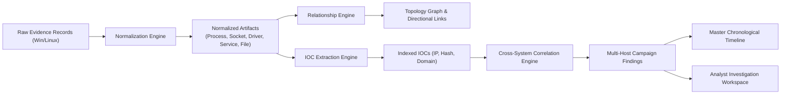

# JOCKY Forensic Investigation & Correlation Walkthrough

## 1. Overview

Step 6 of the JOCKY platform introduces an advanced **Forensic Correlation & Investigation Subsystem**. When an incident spans multiple endpoints across an enterprise network, decentralized telemetry is insufficient. Investigators require standardized models, relationship mappings, automated IOC extraction, cross-system threat correlation, and visual graph exploration.

This document details the correlation engine architecture and provides a walkthrough of the 20 automated checks in the Correlation End-to-End Demonstration (`scripts/e2e_correlation_demo.py`).

---

## 2. Technical Architecture



### 2.1 Forensic Normalization Engine
Heterogeneous operating systems report telemetry differently. JOCKY transforms disparate data into six canonical `NormalizedArtifact` schemas:
- **Process Artifact**: Standardizes `pid`, `ppid`, `name`, `exe_path`, `cmdline`, `username`, `hashes`.
- **Network Socket Artifact**: Standardizes `protocol`, `local_ip`, `local_port`, `remote_ip`, `remote_port`, `state`, `pid`.
- **Driver Artifact**: Standardizes `driver_name`, `display_name`, `path`, `is_signed`, `hashes`.
- **Service Artifact**: Standardizes `service_name`, `display_name`, `binpath`, `status`, `start_type`.
- **Persistence Artifact**: Standardizes `entry_type`, `location` (registry key, cron path, startup folder), `command`, `user`.
- **File Artifact**: Standardizes `file_path`, `size_bytes`, `md5`, `sha256`, `created_at`, `modified_at`.

### 2.2 Directional Artifact Relationships
Artifacts are linked using deterministic semantic relationships:
- `PARENT_OF`: Process hierarchy links (e.g., `cmd.exe` spawned by `powershell.exe`).
- `CONNECTED_TO`: Process-to-network socket links (e.g., `svchost.exe` bound to remote C2 IP `198.51.100.24:443`).
- `LOCATED_AT`: Executable-to-filesystem location links.
- `EXECUTED_FROM`: Persistence entry invoking a specific executable binary.
- `ASSOCIATED_WITH`: Correlated artifacts sharing common IOCs.

### 2.3 Automated IOC Extraction & Indexing
Every normalized artifact is scanned for Indicators of Compromise (IOCs):
- **IP Addresses**: Extracted from network sockets and command lines; validated against bogon and internal network ranges.
- **Domains**: Extracted from DNS queries, hostnames, and URLs.
- **File Hashes**: MD5 and SHA-256 signatures extracted and indexed.
- **File Paths**: Suspicious file system locations (`C:\Users\*\AppData\Local\Temp`, `/tmp`).
- Each IOC receives an initial severity score and occurrence counter across the fleet.

### 2.4 Cross-System Threat Correlation
The correlation engine evaluates multi-endpoint evidence against correlation rules:
1. **Shared C2 Infrastructure**: Flags when multiple hosts (e.g., one Windows desktop and one Linux server) establish outbound connections to the exact same external IP address or domain within a configurable time window.
2. **Identical Malicious Hash**: Flags when identical executable hashes appear across disparate endpoints under different process names (masquerading).
3. **Multi-Stage Campaign Detection**: Correlates early initial access indicators (persistence creation) with secondary actions (network beaconing) across machines.

### 2.5 Dynamic Force-Directed Topology Graph
The React dashboard renders an interactive SVG force-directed topology graph:
- **Node Clustering**: Groups nodes by entity type (Host, Process, Socket, Driver, Service).
- **Severity Rings**: Visual color rings around nodes (`CRITICAL` = Red, `HIGH` = Orange, `MEDIUM` = Yellow).
- **Interactive Drawers**: Clicking any graph node opens an artifact detail panel displaying full metadata and raw JSON.

---

## 3. Running the Investigation & Correlation E2E Demonstration

Execute the automated correlation test script:

```bash
python -m scripts.e2e_correlation_demo
```

### Expected Output (20/20 Checks Passing)

```
============================================================
JOCKY STEP 6 ADVANCED CORRELATION & INVESTIGATION E2E DEMO
============================================================
[1/20] Multi-system test environment initialization... PASS
[2/20] Windows endpoint raw evidence ingestion... PASS
[3/20] Linux endpoint raw evidence ingestion... PASS
[4/20] Forensic normalization into standard artifacts... PASS
[5/20] Process artifact verification... PASS
[6/20] Network socket artifact verification... PASS
[7/20] Persistence artifact verification... PASS
[8/20] Automated IOC extraction (IP, Hash, Domain)... PASS
[9/20] IOC deduplication and severity ranking... PASS
[10/20] Directional relationship extraction (PARENT_OF, CONNECTED_TO)... PASS
[11/20] Cross-system correlation: shared C2 IP detection... PASS
[12/20] Cross-system correlation: shared malware hash detection... PASS
[13/20] Multi-stage campaign finding generation... PASS
[14/20] Master chronological timeline synthesis... PASS
[15/20] Dynamic entity topology graph generation... PASS
[16/20] Graph node-link serialization and clustering... PASS
[17/20] Global forensic search query execution... PASS
[18/20] Investigation case creation & artifact pinning... PASS
[19/20] Point-in-time forensic snapshot freezing... PASS
[20/20] Executive HTML and JSON report export... PASS

============================================================
ALL 20 CORRELATION CHECKS PASSED SUCCESSFULLY!
============================================================
```
